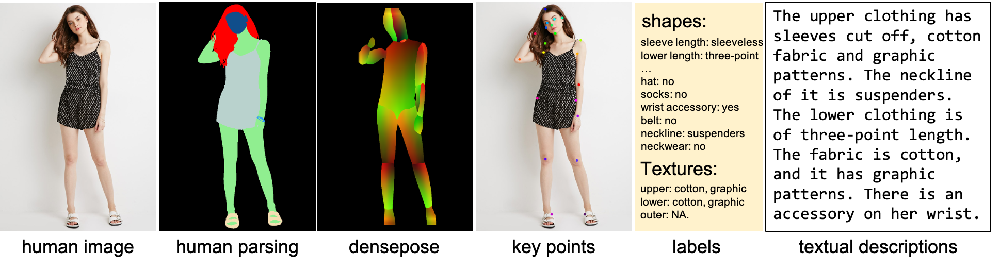
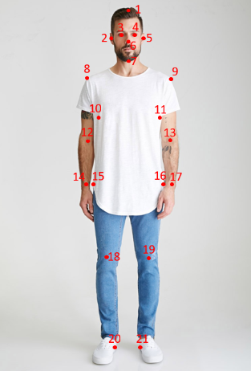

# DeepFashion-MultiModal


**DeepFashion-MultiModal** is a large-scale high-quality human dataset with rich multi-modal annotations. It has the following properties:
1. It contains 44,096 high-resolution human images, including 12,701 full body human images.
2. For each full body images, we **manually annotate** the human parsing labels of 24 classes.
3. For each full body images, we **manually annotate** the keypoints.
4. We extract DensePose for each human image.
5. Each image is **manually annotated** with attributes for both clothes shapes and textures.
6. We provide a textual description for each image.




## Download Links
You can download using the following links:

| Path | Size | Files | Format | Description
| :--- | :---- | ----: | :----: | :----------
| [DeepFashion-MultiModal](https://drive.google.com/drive/folders/11ffwG8ECp0wFgsXp92ZRcIRrNv7ZGPh4?usp=sharing) | ~12 GB | - | | main folder
| &boxvr;&nbsp; [image](https://drive.google.com/file/d/1Rpite24YJfiwkUzEaT8lS2BG1SMYjuvr/view?usp=sharing) | ~5.4 GB | 44,096 | JPG | images from DeepFashion of size 750&times;1101
| &boxvr;&nbsp; [parsing](https://drive.google.com/file/d/1kC48hRH-r7GRt868YeevHjkVNQYTY0hE/view?usp=sharing) | ~90 MB | 12,701 | PNG | manually annotated parsing labels
| &boxvr;&nbsp; [keypoints](https://drive.google.com/file/d/1d4uRX0cZvqiYcnPLf8X2mw8TEKBhAO9I/view?usp=sharing) | 956KB | 2 | TXT | manually annotated keypoints
| &boxvr;&nbsp; [DensePose](https://drive.google.com/file/d/1y3PfUsqHdDpWZd4ycXAZvcqoNzR6nsvL/view?usp=sharing) | ~5.6 GB | 44,096 | PNG | extracted DensePose
| &boxvr;&nbsp; [labels](https://drive.google.com/file/d/1j7mT9KZpN2YlnM_UxV0m3rTdlmXaQ52M/view?usp=sharing) | 575KB | 3 | TXT | three texts for shape, fabric, and color annotations
| &boxvr;&nbsp; [textual descriptions](https://drive.google.com/file/d/13oUPsMmhOWf2z1d68UIjrmhVcAhmNejP/view?usp=sharing) | ~11 MB | 1 | JSON | textual descriptions for each image

## Human Parsing Label
* Mask labels are defined as follows:

| Label list | | | |
| ------------ | ------------- | ------------ | ------------ |
| 0: 'background' | 1: 'top' | 2: 'outer' | 3: 'skirt' |
| 4: 'dress' | 5: 'pants' | 6: 'leggings' | 7: 'headwear' |
| 8: 'eyeglass' | 9: 'neckwear' | 10: 'belt' | 11: 'footwear' |
| 12: 'bag' | 13: 'hair' | 14: 'face' | 15: 'skin' |
| 16: 'ring' | 17: 'wrist wearing' | 18: 'socks' | 19: 'gloves' |
| 20: 'necklace' | 21: 'rompers' | 22: 'earrings' | 23: 'tie' |

* You can read the labels using the following code:

```python
from PIL import Image
import numpy as np

segm = Image.open(f)
segm = np.array(segm) # shape: [750, 1101]
```

## Keypoints
* For each human image, we provide 21 keypoints. The keypoints are defined as follows:



* The `keypoints_loc.txt` file contains the coordinates of the keypoints. The format is as follows:
```
 <x_1> <y_1> <x_2> <y_1> ... <x_21> <y_21>
```
&ensp; If the keypoints are not present, the keypoint is (-1, -1).

* The `keypoints_vis.txt` file indicates the visibility of the keypoints. The format is as follows:
```
 <v_1> <v_2> ... <v_21>
```
&ensp; If the keypoint is visible, the value is 0. If the keypoint is present but hidden by other parts, the value is 1. If the keypoint is not present, the value is 2.

## DensePose
* We extract DensePose using this [repo](https://github.com/facebookresearch/DensePose). Please refer to this repo for more details.

## Labels
### Shape Annotations
* The definitions of shape annotations:
```
  0. sleeve length: 0 sleeveless, 1 short-sleeve, 2 medium-sleeve, 3 long-sleeve, 4 not long-sleeve, 5 NA
  1. lower clothing length: 0 three-point, 1 medium short, 2 three-quarter, 3 long, 4 NA
  2. socks: 0 no, 1 socks, 2 leggings, 3 NA
  3. hat: 0 no, 1 yes, 2 NA
  4. glasses: 0 no, 1 eyeglasses, 2 sunglasses, 3 have a glasses in hand or clothes, 4 NA
  5. neckwear: 0 no, 1 yes, 2 NA
  6. wrist wearing: 0 no, 1 yes, 2 NA
  7. ring: 0 no, 1 yes, 2 NA
  8. waist accessories: 0 no, 1 belt, 2 have a clothing, 3 hidden, 4 NA
  9. neckline: 0 V-shape, 1 square, 2 round, 3 standing, 4 lapel, 5 suspenders, 6 NA
  10. outer clothing a cardigan?: 0 yes, 1 no, 2 NA
  11. upper clothing covering navel: 0 no, 1 yes, 2 NA

  Note: 'NA' means the relevant part is not visible.
```

* The format of shape annotations:
```
  <img_name> <shape_0> <shape_1> ... <shape_11>
```

### Fabric Annotations
* The definitions of fabric annotations:
```
  0 denim, 1 cotton, 2 leather, 3 furry, 4 knitted, 5 chiffon, 6 other, 7 NA

  Note: 'NA' means the relevant part is not visible.
```

* The format of fabric annotations:
```
  <img_name> <upper_fabric> <lower_fabric> <outer_fabric>
```

### Color Annotations
* The definitions of color annotations:
```
  0 floral, 1 graphic, 2 striped, 3 pure color, 4 lattice, 5 other, 6 color block, 7 NA

  Note: 'NA' means the relevant part is not visible.
```

* The format of color annotations:
```
  <img_name> <upper_color> <lower_color> <outer_color>
```


